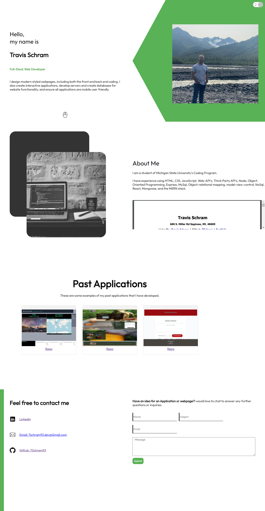

# Portfolio

## Description

This is a website that holds my portfolio, as well as including my resume.

[Deployed Portfolio](https://tschram-portfolio.herokuapp.com/)

## Table of Contents

1. [INSTALLATION](#Installation)
2. [USAGE](#Usage)
3. [TESTS](#Tests)
4. [QUESTIONS](#Questions)
5. [LICENSE](#License)

## Installation

After cloning npm i in the root directory.

## Usage

To view my credentials and gather contact information. My past applications along with a link to my github profiles is included.

## Technologies Used

- Javascript 
- HTML 
- CSS 
- Node JS 
- React

## Tests

No testing was used for this web application.

## Questions

If you have any questions or concerns pertaining to this project, please do not hesitate to contact me at Tschram93.dev@gmail.com and you can find me on github at https://github.com/Tschram93

## License

Licensed under the [MIT](https://opensource.org/licenses/MIT) license.
